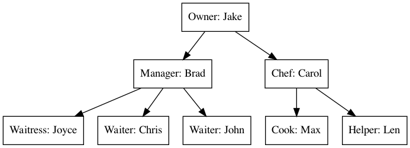

* Table of Contents
{:toc}

# Preface

# 1. Introduction

## 1.1. Abstract Data Types

## 1.2. Algorithms

# 2. C++ Review

## 2.1. Essentials

## 2.2. Objects

# 3. Arrays

# 4. Lists

A **list** is a finite, ordered sequence of data items known as **elements**.
"Ordered" in this definition means that each element has a **position** in the list.
Each list element has a data type.
In this chapter, we assume that all elements of the list have the **same** data type, although there is no conceptual objection to lists whose elements have differing data types if the application requires it.

A list is said to be **empty** when it contains no elements.
The number of elements stored in the list is called the **length** or **size** of the list.
The beginning of the list is called the **head**, the end of the list is called the **tail**.
Each element (except the head and the tail) has exactly one **predecessor** and one **successor** element in the list.

There might or might not be some relationship between the value of an element and its position in the list.
For example, **sorted lists** have their elements positioned in ascending order of value, while **unsorted lists** have no particular relationship between element values and positions.

We will use angle brackets ("$$\langle$$" and "$$\rangle$$") to denote a list.
To be consistent with C++ array indexing, we will denote the first position on the list as $$0$$. If there are $$n$$ elements in the list, they are given positions $$0$$ through $$n − 1$$, as $$\langle a_0, a_1, \ldots, a_{n−1}\rangle$$. The subscript indicates an element's position within the list. Using this notation, the empty list would appear as $$\langle \rangle$$.

> ***Example:***
> A polynomial in a single variable $$x$$ can always be written in the form:
> 
> $$P_n(x) = p_0 + p_1 x + p_2 x^2 + \ldots + p_n x^n $$
> 
> It could be represented by a list $$P = \langle p_0, p_1, p_2, \ldots, p_n \rangle$$ where the subscript indicates the exponent of $$x$$. Given another polynomial $$Q_m(x) = q_0 + q_1 x + \ldots + q_m x^m$$ (without loss of generality, assume $$m \leq n$$), we can represent the *sum* of $$P_n(x)$$ and $$Q_m(x)$$ by a list $$R=\langle p_0+q_0, p_1+q_1, \ldots, p_m+q_m, p_{m+1}, \ldots, p_n \rangle$$.
>
> What if the polynomial is a very *sparse*, for example $$1 + 3 x^{1000} + 2 x^{2000}$$? We will need a list of size 2001 in which only 3 elements have non-zero values using the above representation. To save space, we can use *two* lists to store the coefficients and the exponents, respectively, that is $$\langle 1, 3, 2 \rangle$$ and $$\langle 0, 1000, 2000 \rangle$$. Each pair of values in the two lists indicates one term in the polynomial. In this case, we only need space for 6 elements.

> ***Question:***
> How to compute the sum of two sparse polynomials?

~~~~~~~~~~~~~~~~~~~~~~~~~~~~~~~~~~~~~~~~~~~~~~~~~~~~~~~~~~~~~~~~~~~~~~ cpp
#ifndef __LIST_H__
#define __LIST_H__

namespace ds {

template <typename E> class List { // List ADT
private:
  void operator=(const List &) {} // Protect assignment
  List(const List &) {}           // Protect copy constructor
public:
  List() {}          // Default constructor
  virtual ~List() {} // Base destructor

  // Remove all items from the list.
  virtual void clear() = 0;

  // Append an element at the end of the list.
  // item: The element to be appended.
  virtual void append(const E &item) = 0;

  // Insert an element at a given position.
  // item: The element to be inserted
  // pos: The position of the element before which to insert
  virtual void insert(const E &item, int pos) = 0;

  // Remove and return the element at a given position.
  // pos: The position of the element to be removed
  // Return: the element that was removed.
  virtual E remove(int pos) = 0;

  // Return: The the element at a given position.
  virtual const E &get(int pos) const = 0;

  // Return: The number of elements in the list.
  virtual int length() const = 0;
};

} // namespace ds

#endif // __LIST_H__

~~~~~~~~~~~~~~~~~~~~~~~~~~~~~~~~~~~~~~~~~~~~~~~~~~~~~~~~~~~~~~~~~~~~~~

## 4.1. Array-based Lists

## 4.2. Linked Lists

# 5. Stacks and Queues

# 5. Trees

A tree $$T$$ is defined to be 
 defines a *one-to-many* relation

## 5.1. Binary Trees

<!-- KaTeX -->
<link rel="stylesheet" href="https://cdn.jsdelivr.net/npm/katex@0.12.0/dist/katex.min.css"
    integrity="sha384-AfEj0r4/OFrOo5t7NnNe46zW/tFgW6x/bCJG8FqQCEo3+Aro6EYUG4+cU+KJWu/X" crossorigin="anonymous">

<!-- The loading of KaTeX is deferred to speed up page rendering -->

<!-- To automatically render math in text elements, include the auto-render extension: -->

